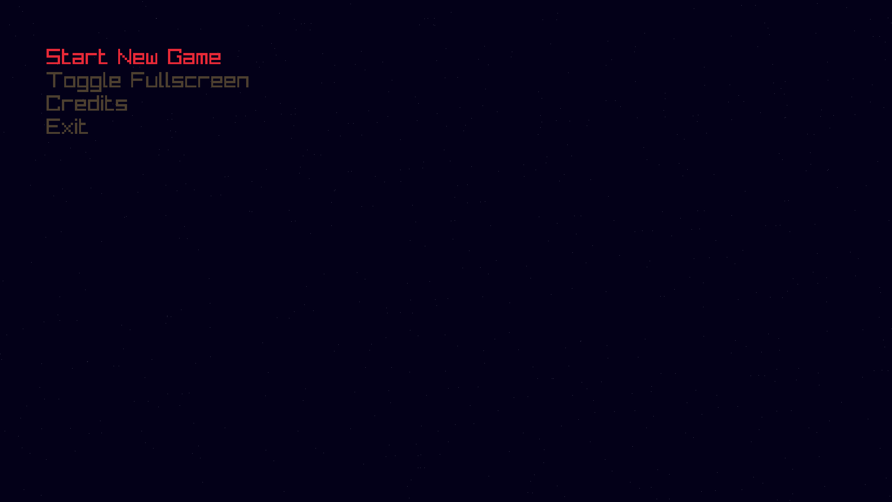
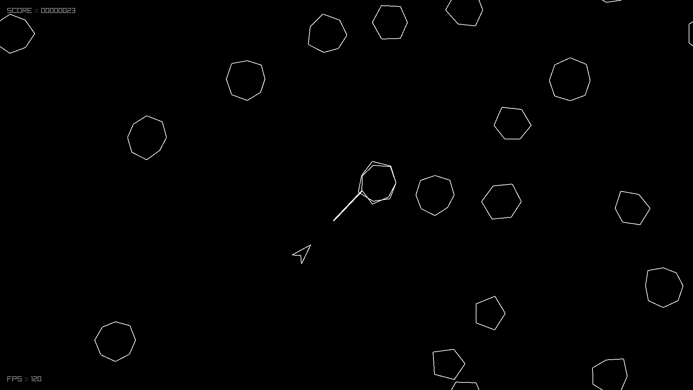
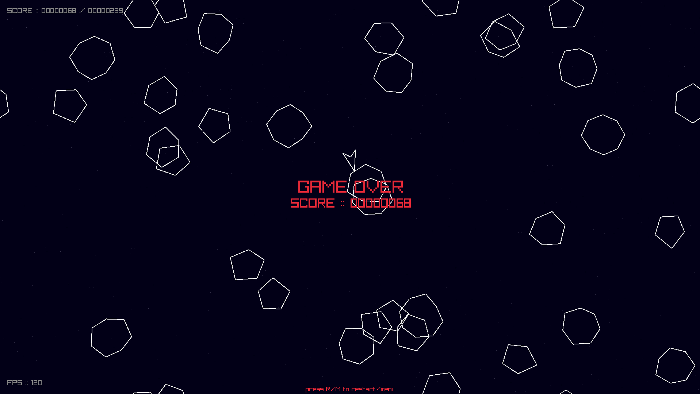
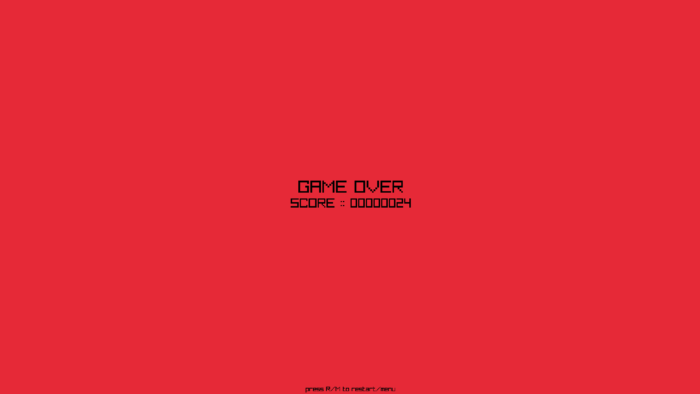

# Rayroids
A small Asteroids-style space shooter game written in C using [raylib](https://github.com/raysan5/raylib).

## Screenshots
<p align="center">
  
  
</p>

<p align="center">
  
  
</p>

## Requirements
- C compiler
- [raylib](https://github.com/raysan5/raylib)

The Makefile expects raylib at `./raylib/include` and `./raylib/lib`.

## Quick Start
Build and Run:
```console
$ make
```
